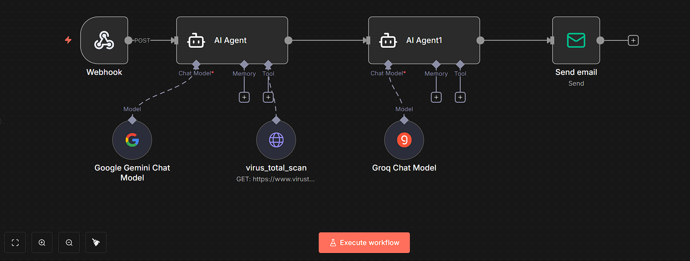
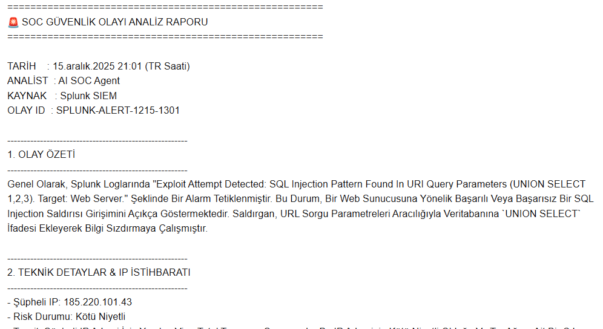

# 🛡️ AI-Powered SOC Analyst Automation

> **Automated Incident Response System** powered by **n8n**, **Splunk**, **Google Gemini**, and **Llama 3**.


This project is an intelligent security automation workflow designed to combat **Alert Fatigue** in SOC (Security Operations Center) environments. It acts as a **Tier 1 SOC Analyst** by automatically capturing alerts from Splunk, enriching them with threat intelligence, analyzing the intent using a "Dual-Engine" AI approach, and generating professional incident reports.



## 🚀 Key Features

* **⚡ Real-time Event Capture:** Listens for HTTP Webhooks triggered by **Splunk** alerts.
* **🕵️ Threat Intelligence Enrichment:** Automatically scans suspicious IP addresses using the **VirusTotal API** to check for reputation and malware history.
* **🧠 Dual-Engine AI Analysis:**
    * **Analyst Engine (Google Gemini):** Deeply analyzes raw logs and threat data to determine attack type (e.g., SQL Injection, Brute Force) and MITRE ATT&CK techniques.
    * **Editor Engine (Llama 3 via Groq):** Formats the analysis into a standardized report and handles logic tasks like **Timezone Conversion (UTC to Local Time)**.
* **📝 Automated Reporting:** Sends a clean, action-oriented email report to the security team, ready for review.

## ⚙️ Architecture & Workflow

1.  **Trigger:** Splunk detects a suspicious pattern (e.g., SQLi attempt) and sends a JSON payload via Webhook.
2.  **Enrich:** n8n extracts the `src_ip` and queries **VirusTotal**.
3.  **Analyze:** The raw log + VirusTotal data is sent to **Google Gemini** with a specific "SOC Analyst" system prompt.
4.  **Refine:** The analysis is passed to **Llama 3 (Groq)** to format the text and calculate the correct local time (e.g., `UTC +3`).
5.  **Act:** An HTML/Text email is sent via SMTP containing the final report.

## 📊 Sample Report Output

The system generates a human-readable report without any manual intervention:



## 🛠️ Splunk Configuration

To trigger this automation, create a **Correlation Search** or **Alert** in Splunk. Here is the SPL (Search Processing Language) query used for this project (focused on SQL Injection):

```splunk
index=web_logs sourcetype=access_combined
| regex uri_query="(?i)(union\s+select|select\s+.*\s+from|insert\s+into|update\s+.*\s+set|OR\s+1=1)"
| stats count by src_ip, uri_query, user_agent, _time
| rename uri_query as message
